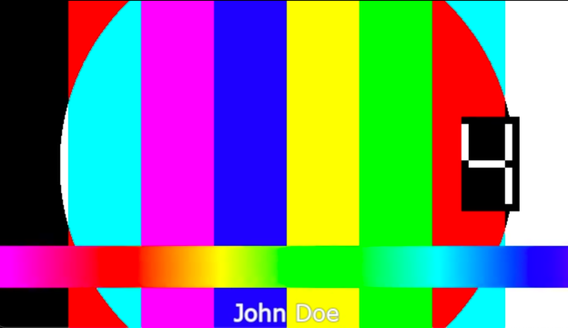

# Membrane FFmpeg Video Filter Plugin

[](https://hex.pm/packages/membrane_ffmpeg_video_filter_plugin)
[](https://hexdocs.pm/membrane_ffmpeg_video_filter_plugin)
[](https://circleci.com/gh/membraneframework/membrane_ffmpeg_video_filter_plugin)

This package contains elements providing video filters based on [ffmpeg video filter feature](https://ffmpeg.org/ffmpeg-filters.html#Video-Filters).

Currently only the TextOverlay element is implemented, based on [ffmpeg drawtext filter](https://ffmpeg.org/ffmpeg-filters.html#drawtext-1).
This element enables adding text on top of given raw video frames.  

PRs with the implementation of other video filters are welcome!

## Installation

The package can be installed by adding `membrane_ffmpeg_video_filter_plugin` to your list of dependencies in `mix.exs`:

```elixir
def deps do
  [
	{:membrane_ffmpeg_video_filter_plugin, "~> 0.8.0"}
  ]
end
```

## Usage

### TextOverlay

Below example pipeline adds "John Doe" text over h264 video in a specified style.

```elixir
defmodule VideoFilter.Pipeline do
  use Membrane.Pipeline

  alias Membrane.File.{Sink, Source}
  alias Membrane.H264.FFmpeg.{Parser, Decoder, Encoder}
  alias Membrane.FFmpeg.VideoFilter.TextOverlay

  @impl true
  def handle_init(_opts) do
    children = %{
      file_src: %Source{location: "input.h264"},
      parser: %Parser{framerate: {10, 1}},
      decoder: Decoder,
      text_filter: %TextOverlay{
        text: "John Doe",
        x: :center,
        fontsize: 25,
        fontcolor: "white",
        border?: true
      },
      encoder: Encoder,
      file_sink: %Sink{location: "output.h264"}
    }

    links = [
      link(:file_src)
      |> to(:parser)
      |> to(:decoder)
      |> to(:text_filter)
      |> to(:encoder)
      |> to(:file_sink)
    ]

    {{:ok, spec: %ParentSpec{children: children, links: links}}, %{}}
  end
end
```

Frame from original video:

Output frame with filter applied:


## Copyright and License

Copyright 2021, [Software Mansion](https://swmansion.com/?utm_source=git&utm_medium=readme&utm_campaign=membrane_ffmpeg_video_filter_plugin)

[](https://swmansion.com/?utm_source=git&utm_medium=readme&utm_campaign=membrane_ffmpeg_video_filter_plugin)

Licensed under the [Apache License, Version 2.0](LICENSE)
